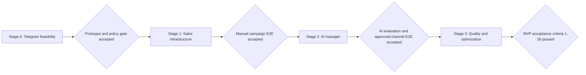

# AI Sales Manager Master Implementation Plan

> **For agentic workers:** REQUIRED SUB-SKILL: Use superpowers:subagent-driven-development (recommended) or superpowers:executing-plans to implement this plan task-by-task. Steps use checkbox (`- [ ]`) syntax for tracking.

**Goal:** Реализовать MVP AI Sales Manager по утверждённому ТЗ версии 1.1 через четыре последовательных, независимо проверяемых этапа.

**Architecture:** Проект строится как монорепозиторий с модульным FastAPI backend, React/Vite frontend, отдельным Telegram connector package и PostgreSQL/pgvector как источником истины. На старте API, web-сборка и Telegram worker развёртываются в одном Railway application service, но границы модулей и очередей позволяют вынести worker и frontend без изменения доменных контрактов.

**Tech Stack:** Python 3.13, FastAPI, SQLAlchemy 2, Alembic, Pydantic 2, Telethon/MTProto adapter, PostgreSQL + pgvector, React, TypeScript, Vite, TanStack Query, Playwright, Pytest, Docker, Railway.

## Global Constraints

- Канонический источник требований: `outputs/AI-Sales-Manager-TZ.md`, версия 1.1 от 7 августа 2026 года.
- Node.js 24 LTS используется для web-сборки; Python 3.13 — для backend и Telegram connector.
- До 10 пользовательских Telegram-аккаунтов на компанию и до 1 000 новых контактов в сутки.
- Цепочка кампании содержит от 1 до 3 сообщений.
- Основные списки должны открываться не более чем за 2 секунды при нормальной сети и типовой выборке.
- Целевой стартовый бюджет Railway — до 20 USD в месяц без AI API, STT, поиска, прокси и сторонних сервисов.
- PostgreSQL является источником истины; Redis не добавляется до подтверждённой необходимости.
- Каждая бизнес-сущность содержит `organization_id`; доступ проверяется в каждом API use case.
- Этап продажи, разрешение на контакт и техническое состояние хранятся независимо; `Игнор` хранится как результат конкретной кампании.
- AI предлагает смысловое действие; backend проверяет права, лимиты, стоп-правила, оффер и допустимость перехода перед отправкой.
- Server-side барьер Telegram/AI работает в режиме `deny by default`; реальные Telegram-сообщения не передаются AI без подходящего утверждённого решения.
- Загруженные TData/session-артефакты удаляются после безопасного преобразования; рабочие сессии и секреты хранятся зашифрованно.
- Активный диалог не переносится между Telegram-аккаунтами автоматически; необработанные контакты недоступного аккаунта возвращаются в очередь.
- Все критические и массовые действия получают автора, время, причину и неизменяемую запись аудита.
- Ежедневные копии хранятся 14 дней, недельные — 8 недель; RPO не более 24 часов, RTO до 4 часов, restore drill выполняется ежемесячно.
- Каждый task выполняется через TDD, заканчивается зелёными целевыми тестами и отдельным коммитом.

---

## Repository Map

```text
apps/
  api/
    app/
      main.py                 # FastAPI composition root
      config.py               # validated environment settings
      db/                     # engine, sessions, migrations hooks
      modules/
        audit/                # immutable audit events
        auth/                 # users, sessions, 2FA, RBAC
        organizations/        # tenant lifecycle and platform access
        telegram/             # accounts, bots, sessions, updates
        proxies/              # proxy pool and health checks
        contacts/             # contacts, identity and imports
        statuses/             # independent state dimensions
        campaigns/            # campaigns, variants, assignments
        messaging/            # outbox, inbox and idempotency
        inbox/                 # manager queues, handoff and shifts
        notifications/        # web and service-bot notifications
        ai/                   # provider contracts and orchestration
        knowledge/            # RAG, versions and moderation
        memory/               # client summaries and facts
        offers/               # catalog, tracking and postback
        integrations/         # Sheets, API and webhooks
        analytics/            # funnels, costs and exports
    tests/
services/
  telegram_connector/
    adapters/                 # phone, QR, TData, session, bot
    runtime/                  # connection lifecycle and updates
    tests/
apps/web/
  src/
    app/                      # routing, providers, auth shell
    features/                 # UI slices matching backend modules
    shared/                   # API client, components and utilities
  tests/
packages/
  contracts/                  # OpenAPI snapshot and generated TS client
infra/
  Dockerfile
  railway/
  scripts/
tests/
  e2e/
  fixtures/
docs/
  architecture/
  runbooks/
```

## Stable Cross-Stage Interfaces

- `TenantContext(organization_id: UUID, actor_id: UUID, roles: frozenset[Role])` accompanies every application command.
- `AuditWriter.append(event: AuditEvent) -> None` records critical actions in the same transaction as their domain change.
- `TelegramGateway.send(command: SendMessageCommand) -> SendResult` is the only path to Telegram sending.
- `PolicyGate.require_ai_operation(context: AiOperationContext) -> ApprovalDecision` enforces the Telegram/AI barrier.
- `StatusService.transition(command: StatusTransitionCommand) -> ContactStateSnapshot` changes exactly one state dimension per call.
- `OutboxRepository.enqueue(message: OutboxMessage) -> UUID` creates idempotent background work in PostgreSQL.
- `AiProvider.complete(request: AiRequest) -> AiDecision` returns structured output and never sends a message.
- `OfferPolicy.validate(offer_id: UUID, contact_id: UUID, campaign_id: UUID) -> ValidatedOffer` protects price, link and terms.
- `WebhookDispatcher.publish(event: DomainEvent) -> None` persists delivery attempts before network I/O.

## Delivery Sequence



## Stage Plans

| Stage | Executable plan | Primary result | Entry condition | Exit condition |
|---|---|---|---|---|
| 0 | `2026-08-07-ai-sales-manager-stage-0-telegram-prototype.md` | Reproducible Telegram prototype and compatibility registry | Approved specification v1.1 | Gate 0 checklist passes; real Telegram content remains unavailable to AI |
| 1 | `2026-08-07-ai-sales-manager-stage-1-sales-infrastructure.md` | Manual end-to-end sales platform | Gate 0 accepted | Import-to-manual-reply campaign completes without loss or duplicates |
| 2 | `2026-08-07-ai-sales-manager-stage-2-ai-manager.md` | Controlled AI dialogue, knowledge, memory and offers | Gate 1 accepted | AI evaluation passes and only approved Telegram scenarios can invoke AI |
| 3 | `2026-08-07-ai-sales-manager-stage-3-quality-optimization.md` | Moderation, experiments, analytics and operational hardening | Gate 2 accepted | All MVP acceptance criteria and recovery tests pass |

## Requirement Coverage Matrix

| Specification area | Plan ownership |
|---|---|
| ORG-001–006, roles and access | Stage 1 Tasks 2–3 |
| TG-001–018, PRX-001–010 | Stage 0 Tasks 2–5; Stage 1 Task 4 |
| TG-019–022 and section 3.3 | Stage 0 Task 6; Stage 2 Tasks 1 and 9 |
| CNT-001–017 | Stage 1 Tasks 5–6 |
| STS-001–011 | Stage 1 Task 7 |
| CMP-001–013, SCH-001–013 | Stage 1 Tasks 8–9 |
| AB-001–006 | Stage 1 Task 8 foundation; Stage 3 Task 3 optimization |
| INB-001–011, NTF-001–004 | Stage 1 Tasks 10–11 |
| AIP-001–008, AID-001–016 | Stage 2 Tasks 1–3 and 8–9 |
| MEM-001–007 | Stage 2 Task 4 |
| KB-001–013 | Stage 2 Task 5; Stage 3 Tasks 1–2 |
| WEB-001–009 | Stage 2 Task 6 |
| OFF-001–011 | Stage 2 Task 7; Stage 3 Task 4 |
| GSH-001–008, INT-001–008 | Stage 1 Task 12 |
| ANL-001–004 | Stage 1 Task 12 baseline; Stage 3 Task 4 |
| BULK-001–007 | Stage 1 Task 6 |
| UI sections 10.1–10.3 | Stage 1 Tasks 3, 4, 6, 8, 10, 12; Stage 2 Task 8 |
| Reliability, security, backup, observability | Stage 1 Tasks 1, 13; Stage 3 Task 5 |
| Error matrix and testing sections 14–16 | Every stage gate; final ownership Stage 3 Task 6 |

### Task 1: Execute Stage 0

**Files:**
- Follow: `docs/superpowers/plans/2026-08-07-ai-sales-manager-stage-0-telegram-prototype.md`
- Produce: `docs/architecture/telegram-compatibility.md`
- Produce: `docs/architecture/telegram-ai-approval-record.md`

**Interfaces:**
- Consumes: approved specification v1.1.
- Produces: tested `TelegramGateway`, session adapters, error taxonomy, compatibility registry and default-deny `PolicyGate`.

- [ ] Run every Stage 0 task in order and retain one reviewed commit per task.
- [ ] Run `pytest services/telegram_connector/tests apps/api/tests/modules/policy -q`.
- [ ] Verify that the compatibility registry contains a result for every declared session class.
- [ ] Verify that no test or prototype path sends real Telegram content to AI.
- [ ] Record the Gate 0 decision in `docs/architecture/stage-0-gate-report.md`.
- [ ] Commit with `git commit -m "docs: record stage 0 gate result"`.

### Task 2: Execute Stage 1

**Files:**
- Follow: `docs/superpowers/plans/2026-08-07-ai-sales-manager-stage-1-sales-infrastructure.md`
- Produce: `docs/runbooks/manual-campaign-pilot.md`

**Interfaces:**
- Consumes: Stage 0 `TelegramGateway`, compatibility registry and policy gate.
- Produces: tenant-safe API, web console, contacts, state model, campaigns, queues, inbox, integrations and recovery controls.

- [ ] Run every Stage 1 task in dependency order and retain one reviewed commit per task.
- [ ] Run `pytest apps/api/tests services/telegram_connector/tests -q`.
- [ ] Run `pnpm --dir apps/web test && pnpm --dir apps/web build`.
- [ ] Run `pnpm --dir apps/web exec playwright test tests/e2e/stage1-manual-campaign.spec.ts`.
- [ ] Execute the backup restore drill from `docs/runbooks/backup-restore.md`.
- [ ] Record the Gate 1 result in `docs/architecture/stage-1-gate-report.md`.
- [ ] Commit with `git commit -m "docs: record stage 1 gate result"`.

### Task 3: Execute Stage 2

**Files:**
- Follow: `docs/superpowers/plans/2026-08-07-ai-sales-manager-stage-2-ai-manager.md`
- Produce: `docs/runbooks/ai-evaluation.md`

**Interfaces:**
- Consumes: Stage 1 domain services, outbox, inbox, status model and policy gate.
- Produces: provider-neutral AI orchestration, profiles, RAG, memory, offers, controlled search, voice and manager handoff.

- [ ] Run every Stage 2 task in dependency order and retain one reviewed commit per task.
- [ ] Run `pytest apps/api/tests/modules/ai apps/api/tests/modules/knowledge apps/api/tests/modules/memory apps/api/tests/modules/offers -q`.
- [ ] Run the fixed AI evaluation dataset and require every safety invariant to pass.
- [ ] Run the approved-channel and denied-channel policy-gate integration tests.
- [ ] Run `pnpm --dir apps/web exec playwright test tests/e2e/stage2-ai-dialog.spec.ts`.
- [ ] Record the Gate 2 result in `docs/architecture/stage-2-gate-report.md`.
- [ ] Commit with `git commit -m "docs: record stage 2 gate result"`.

### Task 4: Execute Stage 3 and Release MVP

**Files:**
- Follow: `docs/superpowers/plans/2026-08-07-ai-sales-manager-stage-3-quality-optimization.md`
- Produce: `docs/runbooks/mvp-release.md`
- Produce: `docs/architecture/mvp-acceptance-report.md`

**Interfaces:**
- Consumes: all Stage 0–2 production interfaces and gate reports.
- Produces: moderated learning, version propagation, experiments, analytics, operational hardening and release evidence.

- [ ] Run every Stage 3 task in dependency order and retain one reviewed commit per task.
- [ ] Run the complete backend, connector, frontend and Playwright suites.
- [ ] Run load, restart, duplicate-delivery, backup-restore and provider-failure drills.
- [ ] Map acceptance criteria 1–26 to test IDs and evidence in `docs/architecture/mvp-acceptance-report.md`.
- [ ] Confirm that all failed or waived checks have an owner and explicit release decision; do not mark the gate accepted while a mandatory criterion fails.
- [ ] Tag the accepted commit with `git tag -a v0.1.0-mvp -m "AI Sales Manager MVP"`.
- [ ] Push the branch and tag only after the acceptance report is approved.

## Planning Baseline

- Recommended team: two backend/Telegram engineers, one frontend engineer, one AI engineer, and a QA engineer shared across stages.
- Stage 0 is strictly sequential and blocks Stage 1 connector assumptions.
- Stage 1 backend foundations can proceed in parallel after Task 1, but campaigns depend on contacts/statuses and inbox depends on messaging.
- Stage 2 knowledge, memory and offers can proceed in parallel after the AI contract is frozen.
- Stage 3 analytics depends on stable event schemas from Stages 1–2; load and recovery testing runs against a release candidate.
- Re-estimation occurs at each gate using completed throughput and newly discovered Telegram constraints; scope is reduced before quality or safety criteria are weakened.

## Current Technical References

- Python active releases: <https://www.python.org/downloads/>
- Node.js release status: <https://nodejs.org/en/about/previous-releases>
- Railway services: <https://docs.railway.com/services>
- Telegram API Terms: <https://core.telegram.org/api/terms>
- Telegram Bot Platform Terms: <https://telegram.org/tos/bot-developers>
