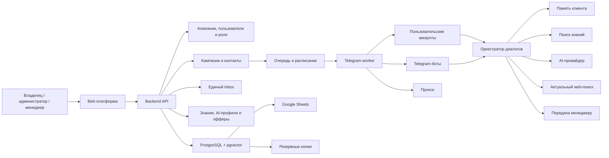
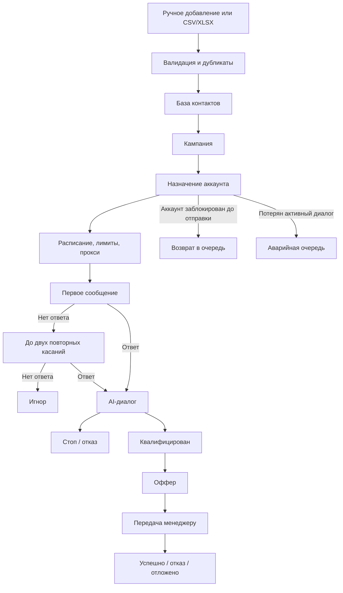

# Техническое задание: платформа AI Sales Manager

**Версия:** 1.0  
**Дата:** 7 августа 2026 года  
**Статус:** согласованный проект ТЗ для оценки и планирования разработки  
**Целевая стадия:** MVP для владельца проекта и нескольких дружественных компаний с архитектурой, допускающей будущий переход к SaaS

---

## 1. Назначение документа

Документ определяет требования к платформе AI Sales Manager — системе для исходящих и входящих продаж через Telegram с применением искусственного интеллекта.

Платформа должна:

- подключать несколько пользовательских Telegram-аккаунтов и Telegram-ботов;
- загружать клиентскую базу по username и номерам телефонов;
- запускать управляемые цепочки исходящих сообщений;
- вести естественные диалоги через настраиваемые AI-профили специалистов;
- использовать базу знаний компании, общие знания AI и контролируемый поиск актуальной информации;
- хранить историю, память и статус каждого клиента независимо от Telegram-аккаунта;
- предлагать собственные и партнёрские офферы;
- передавать сложные и целевые диалоги менеджерам;
- фиксировать результаты, выплаты и события в собственной базе, Google Sheets и внешних системах через API/webhooks;
- накапливать проверенный опыт прошлых диалогов без автоматического загрязнения базы знаний.

Документ одновременно разделяет:

1. функции, выполняемые AI-модулем во время работы продукта;
2. функции, которые должны быть реализованы программным кодом;
3. работы AI-специалиста, backend- и frontend-разработчиков;
4. объём трёх последовательных этапов выпуска.

---

## 2. Цели продукта

### 2.1. Основные цели

- Автоматизировать первичный контакт и типовые продажи в Telegram.
- Сохранить управляемость сообщений, офферов, знаний и лимитов.
- Обеспечить непрерывность данных при блокировке, удалении или замене Telegram-аккаунта.
- Сократить долю диалогов, требующих постоянного участия менеджера.
- Дать менеджеру единое рабочее место с полной историей и AI-подсказками.
- Получать измеримую аналитику по аккаунтам, кампаниям, сообщениям, офферам и менеджерам.
- Переносить подтверждённый опыт между аккаунтами и кампаниями.

### 2.2. Критерий ценности MVP

MVP считается полезным, если платформа позволяет провести пилотную кампанию полным циклом: импортировать контакты, распределить их между аккаунтами, отправить цепочку с заданными ограничениями, получить ответы, провести AI-диалоги, передать исключения менеджерам, сохранить результаты и выгрузить их в Google Sheets без потери истории и повторных отправок.

### 2.3. Масштаб MVP

- До 10 подключённых пользовательских Telegram-аккаунтов на компанию.
- Отдельные Telegram-боты как входящие каналы.
- До 1 000 новых контактов в сутки.
- Несколько компаний в одной установке.
- Один активный AI-профиль на диалог.
- Размещение на Railway Hobby с целевым стартовым бюджетом инфраструктуры до 20 USD в месяц, без учёта AI API, распознавания речи, поиска, прокси и сторонних сервисов.

---

## 3. Границы и принципы системы

### 3.1. Основные принципы

1. Клиент, диалог, память и стадия воронки существуют независимо от Telegram-аккаунта.
2. Telegram-аккаунт является каналом доставки, а не владельцем клиентских данных.
3. AI формирует смысловое решение, но программа проверяет правила и выполняет отправку.
4. Цены, скидки, ссылки и условия берутся только из утверждённого каталога офферов.
5. Новые знания не применяются без ручного подтверждения владельца или администратора компании.
6. Активный диалог не переносится на другой пользовательский аккаунт автоматически.
7. Неотправленные контакты заблокированного аккаунта не теряются и возвращаются в очередь.
8. Все критические действия имеют автора, время, причину и запись в аудите.
9. Данные каждой компании логически изолированы.
10. Компоненты проектируются модульно, даже если в MVP запускаются в одном Railway-сервисе.

### 3.2. Ограничения текущего ТЗ

- Не разрабатываются биллинг, публичные тарифы и самостоятельная регистрация массовых SaaS-клиентов.
- Не создаются готовые коннекторы к конкретным CRM; используются универсальные API, webhooks и экспорты.
- Не реализуется автоматическое дообучение или fine-tuning базовой AI-модели на Telegram-переписках. Накопление опыта выполняется через память, аналитику и модерируемую базу знаний.
- Не описываются источники приобретения Telegram-аккаунтов или способы обхода ограничений Telegram.
- Не гарантируется доставка сообщения, отсутствие ограничений или срок жизни Telegram-аккаунта.
- Юридические требования конкретной страны не входят в этот документ. Технические возможности хранения, удаления, экспорта, контроля доступа и аудита должны быть реализованы независимо от последующего юридического решения.

---

## 4. Роли и модель доступа

### 4.1. Владелец платформы

Владелец платформы управляет всей установкой:

- создаёт, блокирует и архивирует компании;
- назначает владельца компании;
- видит общее техническое состояние, расходы и ошибки;
- управляет общими ключами AI, поиска и распознавания речи;
- может открыть содержимое чужой компании только отдельным действием;
- при открытии чужих диалогов обязан указать причину;
- каждое такое действие записывается в неизменяемый аудит.

### 4.2. Владелец компании

- Управляет своей компанией, администраторами и менеджерами.
- Настраивает внешние ключи, интеграции и сроки хранения.
- Имеет полный доступ к аккаунтам, прокси, кампаниям, знаниям, офферам, аналитике и экспорту.
- Подтверждает критические и массовые действия.

### 4.3. Администратор компании

- Управляет сотрудниками, сменами, аккаунтами, прокси и кампаниями.
- Создаёт AI-профили, знания и офферы.
- Подтверждает кандидатов в знания.
- Управляет стоп-листом и подтверждёнными блокировками.
- Выполняет интеграции и экспорт в пределах компании.

### 4.4. Менеджер

- Работает с назначенными диалогами и общей очередью.
- Отправляет ручные сообщения от имени подключённого аккаунта.
- Получает AI-черновики.
- Меняет рабочие статусы и примечания.
- Может добавить клиента в стоп-лист или вручную подтвердить блокировку с обязательной причиной.
- Не может массово снимать запреты, менять системные лимиты, подключать сессии или утверждать знания.

### 4.5. Общие требования доступа

- Вход по email и паролю.
- Обязательная 2FA для владельца платформы, владельца компании и администратора.
- Управление активными веб-сессиями и принудительное завершение входов.
- Проверка прав на уровне каждого API-запроса.
- Каждая бизнес-сущность содержит идентификатор компании.
- Менеджер видит только разрешённые компании и диалоги.

---

## 5. Архитектура верхнего уровня

### 5.1. Логические модули

- Web UI.
- Backend API.
- Модуль авторизации и компаний.
- Telegram Connector/Worker.
- Контакты и идентификация.
- Кампании и очередь.
- Оркестратор AI-диалогов.
- Память и база знаний.
- Каталог офферов и tracking.
- Единый inbox и handoff.
- Аналитика.
- Google Sheets/API/webhooks.
- Уведомления.
- Аудит, мониторинг и резервирование.

---

## 6. Функциональные требования

### 6.1. Компании и системное администрирование

**ORG-001.** Владелец платформы должен создавать компанию и первого владельца.  
**ORG-002.** Компания должна иметь собственные настройки, ключи, пользователей, аккаунты, знания, офферы, кампании и интеграции.  
**ORG-003.** Компания может использовать общие ключи платформы либо собственные ключи AI, поиска и распознавания речи.  
**ORG-004.** Использование внешних сервисов рассчитывается отдельно по компании независимо от источника ключа.  
**ORG-005.** Блокировка компании останавливает новые автоматические отправки, но не удаляет данные.  
**ORG-006.** Доступ владельца платформы к чужому содержимому требует отдельного подтверждения, причины и записи в аудит.

### 6.2. Подключение Telegram-аккаунтов и ботов

**TG-001.** Платформа должна поддерживать пользовательские Telegram-аккаунты как основной исходящий и входящий канал.  
**TG-002.** Telegram-боты должны поддерживаться как отдельные входящие каналы.  
**TG-003.** Способы подключения пользовательского аккаунта:

- вход по номеру телефона, коду и 2FA;
- вход по QR-коду;
- импорт поддерживаемого `TData`;
- импорт поддерживаемого session-файла;
- импорт поддерживаемой session-string.

**TG-004.** Импорт доступен только владельцу и администратору.  
**TG-005.** До первого рабочего подключения импортированный аккаунт помещается в карантин.  
**TG-006.** Проверка должна определить Telegram ID, доступные username/телефон, состояние авторизации и возможность выполнять необходимые операции.  
**TG-007.** Исходный загруженный архив или файл должен удаляться после безопасного преобразования.  
**TG-008.** Рабочая сессия хранится зашифрованно и не может быть повторно скачана через интерфейс.  
**TG-009.** Поддерживаемые форматы и версии публикуются в реестре совместимости продукта. Неизвестный или повреждённый формат отклоняется.  
**TG-010.** В первой технической итерации обязательна проверка классов форматов Telegram Desktop TData и Telethon file/string session. Другие форматы добавляются отдельными адаптерами только после воспроизводимого теста.  
**TG-011.** Бот подключается по токену, который хранится зашифрованно.  
**TG-012.** Система показывает статус, дату последней активности, ошибки, лимиты, прокси и текущую очередь аккаунта.  
**TG-013.** Состояния аккаунта: `Карантин`, `Активен`, `Приостановлен`, `Требует авторизации`, `Ограничен`, `Заблокирован`, `Архивирован`.  
**TG-014.** Архивирование прекращает работу и удаляет активную рабочую сессию, но сохраняет переписки, статистику и историю.  
**TG-015.** Платформа должна принимать все личные входящие сообщения подключённого аккаунта. Группы, каналы и служебные чаты не импортируются в CRM.  
**TG-016.** Неизвестный личный отправитель создаётся как клиент с источником `Входящий Telegram`.  
**TG-017.** Для каждого аккаунта и бота задаются входящий сценарий и AI-профиль по умолчанию. При отсутствии настройки новый диалог передаётся менеджеру.  
**TG-018.** Система должна обрабатывать требования Telegram к возможности контакта, включая недоступный username/телефон, приватность, ограничения аккаунта и платные сообщения. Автоматическая трата платёжных единиц запрещена без отдельного лимита и разрешения администратора.

### 6.3. Прокси

**PRX-001.** Поддерживаются SOCKS5 и HTTP(S), включая логин и пароль.  
**PRX-002.** Можно задать общий прокси исходящих соединений и индивидуальный прокси аккаунта; индивидуальный имеет приоритет.  
**PRX-003.** Для прокси задаются адрес, порт, тип, авторизация и допустимая ёмкость аккаунтов.  
**PRX-004.** Один прокси может обслуживать несколько аккаунтов, например от 1 до 5, если администратор установил такую ёмкость.  
**PRX-005.** Платформа не назначает аккаунты сверх ёмкости.  
**PRX-006.** Проверяются доступность, фактический IP, страна, задержка и время последней проверки.  
**PRX-007.** Состояния: `Активен`, `Нестабилен`, `Недоступен`.  
**PRX-008.** При отказе прокси отправка с привязанного аккаунта останавливается до восстановления или ручного переназначения.  
**PRX-009.** Учетные данные прокси шифруются и не выводятся в журналы.  
**PRX-010.** Автоматическая ротация для обхода ограничений Telegram не является функцией продукта.

### 6.4. Контакты, импорт и идентификация

**CNT-001.** Контакт добавляется вручную либо импортируется из CSV/XLSX.  
**CNT-002.** Минимальные идентификаторы: username или телефон. Дополнительные поля могут включать имя, компанию, продукт, теги и пользовательские значения.  
**CNT-003.** При импорте пользователь сопоставляет колонки файла с полями системы.  
**CNT-004.** До подтверждения показываются количество валидных строк, ошибки, дубликаты, стоп-лист и предполагаемые совпадения.  
**CNT-005.** Telegram ID является наиболее надёжным идентификатором. Совпадения по изменяемому username или телефону могут требовать проверки.  
**CNT-006.** Надёжные совпадения объединяются автоматически; спорные попадают в очередь дубликатов.  
**CNT-007.** Карточка хранит историю идентификаторов и источников данных.  
**CNT-008.** Один контакт может входить в несколько аудиторий, но в рамках компании одновременно допускается только один активный исходящий диалог.  
**CNT-009.** После завершения диалога автоматического периода запрета нет. Администратор самостоятельно решает, когда и в какую новую кампанию добавить клиента.  
**CNT-010.** Стоп-лист и подтверждённый блок отображаются при добавлении контакта в кампанию.  
**CNT-011.** Контакт со стоп-статусом можно включить в список для аналитики, но постановка в очередь требует отдельного снятия запрета владельцем или администратором.  
**CNT-012.** Снятие запрета требует причины, подтверждающей галочки и записи в аудит.  
**CNT-013.** Поддерживаются массовые действия по выбранным строкам, текущей странице и всем результатам фильтра.  
**CNT-014.** Перед массовым действием показываются точное количество и разбивка по статусам.  
**CNT-015.** Массовое снятие запретов выполняется фоновой задачей, доступно только владельцу/администратору, требует общей причины и подтверждения.  
**CNT-016.** По завершении массовой операции доступен отчёт: успешно, пропущено, ошибка и причина по каждой строке.  
**CNT-017.** Другие массовые действия: добавление в кампанию, назначение тегов, смена менеджера, экспорт, архивирование и разрешённая смена статуса.

### 6.5. Стоп-листы, блокировки и конечные списки

**STS-001.** Система должна поддерживать результаты: `Новый`, `Сообщение отправлено`, `Ответил`, `Квалифицирован`, `Оффер отправлен`, `Передан менеджеру`, `Успешно`, `Отказ`, `Игнор`, `Стоп-лист`, `Предполагаемый блок`, `Подтверждённый блок`, `Невалидный контакт`, `Техническая ошибка`.  
**STS-002.** `Игнор` устанавливается после завершения настроенной цепочки без ответа.  
**STS-003.** Просьба не писать и явно негативный отказ переводят клиента в глобальный стоп-лист компании.  
**STS-004.** Косвенные признаки дают только `Предполагаемый блок`.  
**STS-005.** `Подтверждённый блок` устанавливается по однозначному техническому сигналу либо вручную менеджером с примечанием.  
**STS-006.** Для каждого статуса сохраняются кампания, аккаунт, номер касания, дата, причина, комментарий, автор и история изменений.  
**STS-007.** Пример примечания: `Заблокировал аккаунт @sales_1 после второго сообщения кампании Август`.  
**STS-008.** Статус `Успешно` поступает из CRM/партнёрской системы через webhook либо подтверждается менеджером. AI может предложить только `Готов к покупке`.  
**STS-009.** Отдельные списки в интерфейсе являются фильтрами единой модели данных, а не независимыми копиями клиента.

### 6.6. Кампании

**CMP-001.** Состояния кампании: `Черновик`, `Тестирование`, `Подтверждена`, `Запущена`, `Приостановлена`, `Завершена`, `Архивирована`.  
**CMP-002.** Кампания содержит цель, аудиторию, продукт/направление, AI-профиль, офферы, аккаунты, расписание, цепочку, лимиты и критерии передачи.  
**CMP-003.** Контакты распределяются вручную либо автоматически.  
**CMP-004.** Автоматическое распределение учитывает состояние аккаунта и прокси, лимиты и текущую очередь.  
**CMP-005.** Если аккаунту назначено 50 контактов, 20 обработаны и аккаунт заблокирован, остальные 30 возвращаются в общий пул.  
**CMP-006.** Контакты с неопределённым результатом отправки сначала сверяются, чтобы не допустить дубль.  
**CMP-007.** Активный диалог заблокированного аккаунта попадает в аварийную очередь и не переносится автоматически.  
**CMP-008.** Цепочка содержит от 1 до 3 сообщений.  
**CMP-009.** Структура сообщений задаётся шаблоном; AI персонализирует текст в разрешённых границах.  
**CMP-010.** Перед запуском доступны примеры персонализации на тестовых контактах.  
**CMP-011.** Обязательны тестовый AI-диалог, проверка цепочки и подтверждение владельцем/администратором.  
**CMP-012.** Кампания останавливается вручную или автоматически по критическим порогам ошибок.  
**CMP-013.** Повторный запуск не создаёт повторные задания для уже обработанных касаний.

### 6.7. Расписание, задержки и адаптивный темп

**SCH-001.** Расписание по умолчанию: ежедневно с 10:00 до 20:00 по московскому времени.  
**SCH-002.** Администратор может менять дни, часовой пояс и окна отдельно по кампании.  
**SCH-003.** Часовой пояс клиента не определяется автоматически; при отсутствии данных применяется пояс кампании.  
**SCH-004.** Поддерживаются разрешённые окна исходящих касаний и отдельные тихие часы.  
**SCH-005.** Тихие часы имеют более высокий приоритет.  
**SCH-006.** Переключатель `Отвечать на входящие в тихие часы` задаётся на уровне компании и кампании. По умолчанию включён.  
**SCH-007.** Ручной ответ менеджера в тихие часы разрешён после предупреждения.  
**SCH-008.** Отложенное сообщение переносится на ближайшее допустимое время.  
**SCH-009.** Администратор задаёт жёсткие дневные лимиты и диапазоны задержек.  
**SCH-010.** Платформа добавляет случайную задержку в пределах настроек.  
**SCH-011.** Адаптивный режим может снижать темп при ошибках и ограничениях, но не превышает лимиты администратора.  
**SCH-012.** При критическом сигнале аккаунт или кампания приостанавливаются до проверки.  
**SCH-013.** Система не обещает обходить лимиты Telegram и не использует замену аккаунта как автоматический способ продолжить активный диалог.

### 6.8. A/B-тестирование

**AB-001.** В кампании можно создать несколько вариантов первого и повторных сообщений.  
**AB-002.** Контакты распределяются между активными вариантами равномерно либо в заданных долях.  
**AB-003.** Для теста выбирается основной показатель: ответ, квалификация, передача, успешная сделка или партнёрская конверсия.  
**AB-004.** Платформа показывает объём выборки, результат и статистическую уверенность.  
**AB-005.** Победитель не получает весь трафик без подтверждения администратора.  
**AB-006.** Изменение варианта создаёт новую версию и не смешивает старую статистику.

### 6.9. Единый inbox и менеджеры

**INB-001.** Интерфейс должен показывать общую очередь, личные назначения, срочные передачи, аварийные диалоги, просроченные, AI-диалоги и ожидающие менеджера.  
**INB-002.** Фильтры: компания, кампания, аккаунт, статус, причина передачи, менеджер, AI-профиль и период.  
**INB-003.** Карточка содержит переписку, идентификаторы, кампанию, аккаунт, стадию, память, оффер, причину передачи, источники, примечания и историю статусов.  
**INB-004.** После подключения менеджера автоматические ответы останавливаются.  
**INB-005.** AI продолжает предлагать черновики, но не отправляет их автоматически.  
**INB-006.** Вернуть диалог AI может менеджер, администратор или владелец отдельным действием.  
**INB-007.** Режимы распределения: общая очередь и по кругу.  
**INB-008.** Менеджер участвует в распределении только в рабочей смене, со статусом `На линии` и ниже лимита активных диалогов.  
**INB-009.** При отсутствии доступных менеджеров обращение остаётся в срочной очереди, а владелец/администратор получает уведомление.  
**INB-010.** Передача содержит резюме, потребность, выбранный оффер, причину и рекомендуемый следующий шаг.  
**INB-011.** Причины передачи настраиваются и включают просьбу человека, готовность купить, нестандартный вопрос, негатив, конфликт источников, особые условия и низкую уверенность AI.

### 6.10. Уведомления

**NTF-001.** Уведомления доступны в веб-платформе и служебном Telegram-боте.  
**NTF-002.** События: новая передача, негатив, готовность купить, просрочка, отсутствие менеджеров, аварийный диалог, ошибка аккаунта/прокси, остановка кампании, сбой интеграции и резервного копирования.  
**NTF-003.** Пользователь может настраивать категории и тихие часы уведомлений.  
**NTF-004.** Критические технические уведомления владельца платформы нельзя полностью отключить.

### 6.11. AI-профили специалистов

**AIP-001.** Компания может создавать несколько AI-профилей.  
**AIP-002.** Кампания и входящий канал выбирают один активный профиль.  
**AIP-003.** Профиль содержит роль, сферу, глубину компетенции, цели, тон, терминологию, вопросы квалификации, источники, офферы, ограничения, примеры и тестовые вопросы.  
**AIP-004.** Один профиль действует в одном диалоге; автоматическое обсуждение между несколькими агентами в MVP не реализуется.  
**AIP-005.** Профиль и связанные настройки версионируются.  
**AIP-006.** Новая версия по умолчанию применяется к новым диалогам.  
**AIP-007.** Критическую версию можно распространить на активные диалоги отдельным подтверждением.  
**AIP-008.** Для каждого AI-ответа сохраняются версии профиля, знаний и оффера.

### 6.12. AI-диалог

**AID-001.** AI самостоятельно обрабатывает типовые ситуации и передаёт исключения менеджеру.  
**AID-002.** На вход AI получает:

- профиль и правила компании;
- профиль кампании;
- релевантные утверждённые знания;
- разрешённые офферы;
- карточку и память клиента;
- последние сообщения и резюме;
- доступные действия и ограничения.

**AID-003.** AI возвращает структурированный результат:

- текст ответа;
- язык;
- намерение и настроение;
- потребность и извлечённые факты;
- уровень уверенности;
- рекомендуемый статус;
- выбранный offer ID и объяснение;
- флаг передачи и причина;
- обновлённое резюме;
- возможный кандидат в знания;
- использованные внутренние и внешние источники.

**AID-004.** Backend валидирует результат и только затем выполняет действие.  
**AID-005.** AI не может самостоятельно снимать запреты, менять лимиты, цены, ссылки, права или утверждать знания.  
**AID-006.** При отсутствии достоверного ответа AI не придумывает факт и передаёт диалог.  
**AID-007.** AI определяет язык клиента и отвечает на нём при наличии утверждённых материалов; иначе передаёт менеджеру.  
**AID-008.** Текст и голосовые поддерживаются автоматически.  
**AID-009.** Голосовое сообщение расшифровывается, сохраняются текст и оценка качества распознавания.  
**AID-010.** Изображения, видео и документы направляются менеджеру.  
**AID-011.** AI может отправлять только утверждённые файлы, изображения, ссылки и карточки офферов.  
**AID-012.** Ошибка или тайм-аут не приводят к пустому, частичному или повторному сообщению. Выполняется ограниченный повтор либо handoff.  
**AID-013.** Основной провайдер подключается через единый адаптер; может быть настроен резервный.  
**AID-014.** AI может использовать общие знания базовой модели для естественного разговора, профессиональных объяснений и понимания контекста, если они не противоречат утверждённым данным компании.  
**AID-015.** Если общий факт зависит от текущей даты, влияет на решение клиента или мог измениться, AI обязан проверить его через настроенный внешний поиск либо передать вопрос менеджеру.

### 6.13. Память клиента

**MEM-001.** Полная история сообщений хранится отдельно от краткой памяти.  
**MEM-002.** Память включает потребность, возражения, предпочтения, договорённости, выбранный оффер, стадию и следующий шаг.  
**MEM-003.** Память обновляется после значимых сообщений и сохраняет ссылку на источник факта.  
**MEM-004.** Менеджер может просмотреть и исправить память; изменения аудируются.  
**MEM-005.** Архивирование или блокировка аккаунта не удаляет память.  
**MEM-006.** Память конкретного клиента не превращается автоматически в общую базу компании.  
**MEM-007.** Новый подключённый аккаунт использует общие AI-профили, утверждённые знания и накопленный опыт компании. При повторной идентификации клиента доступна его прежняя история, но активный диалог не переносится между аккаунтами автоматически.

### 6.14. База знаний и контролируемое накопление опыта

**KB-001.** Источники базы: PDF, DOCX, XLSX, TXT и структурированные разделы редактора.  
**KB-002.** Структурированные разделы: компания, продукты, цены, FAQ, возражения, правила общения и другие пользовательские категории.  
**KB-003.** Документ проходит извлечение текста, разбиение, индексацию и проверку ошибок.  
**KB-004.** Скан без извлекаемого текста помечается как требующий OCR или ручной обработки; ошибочный пустой документ не публикуется.  
**KB-005.** Знания имеют версии, статус публикации, автора и дату.  
**KB-006.** AI извлекает из диалогов кандидатов, но не публикует их.  
**KB-007.** Кандидат содержит формулировку, категорию, источник, фрагмент диалога, уверенность, полезность, похожие и противоречащие знания.  
**KB-008.** Перед публикацией выполняется проверка дублей, противоречий и персональных данных.  
**KB-009.** Владелец/администратор подтверждает, редактирует, отклоняет или архивирует кандидата.  
**KB-010.** Только подтверждённые знания участвуют в новых ответах.  
**KB-011.** Изменение можно откатить.  
**KB-012.** Статистический опыт — частые возражения, успешные формулировки и причины отказов — хранится отдельно от фактической базы знаний.  
**KB-013.** Система не выполняет fine-tuning базовой модели на Telegram-данных.

### 6.15. Актуальный внешний поиск

**WEB-001.** Поиск включается и настраивается по AI-профилю.  
**WEB-002.** Приоритет: официальные источники, разрешённые отраслевые сайты, затем общий поиск при нехватке данных.  
**WEB-003.** Для ответа сохраняются запрос, URL, название, дата, извлечённый факт и оценка надёжности.  
**WEB-004.** Внешняя информация не меняет утверждённые цены, скидки, партнёрские ссылки и условия компании.  
**WEB-005.** При конфликте с базой компании выполняется handoff.  
**WEB-006.** Инструкции, найденные на внешней странице, рассматриваются как недоверенный контент и не могут менять системное поведение AI.  
**WEB-007.** Режим отображения источников:

- только внутренняя проверка — по умолчанию;
- показывать по запросу клиента;
- всегда добавлять клиенту.

**WEB-008.** Менеджер всегда видит источник, независимо от клиентского режима.  
**WEB-009.** Актуальные факты кешируются на настраиваемый срок, после которого проверяются повторно.

### 6.16. Каталог офферов и партнёрские предложения

**OFF-001.** Типы: собственный продукт/услуга, партнёрское предложение, реферальная ссылка, лидогенерация, промокод, материал или лендинг.  
**OFF-002.** Поля: название, рекламодатель, описание, аудитория, ссылка, tracking-параметры, география, кампании, AI-профили, условия, срок, лимит, приоритет, обязательные и запрещённые формулировки, материалы и версии.  
**OFF-003.** AI выбирает только активный оффер, удовлетворяющий условиям.  
**OFF-004.** AI не изменяет цену, ссылку, промокод или условия.  
**OFF-005.** При необходимости применяется утверждённая пометка о партнёрском характере.  
**OFF-006.** Клики проходят через внутренний redirect с сохранением campaign/contact/offer/variant ID.  
**OFF-007.** Результаты партнёрской программы принимаются через подписанный postback/webhook.  
**OFF-008.** Статусы: `Клик`, `Лид`, `Ожидает подтверждения`, `Подтверждена`, `Отклонена`.  
**OFF-009.** Выплата и валюта поступают автоматически либо вводятся менеджером вручную.  
**OFF-010.** Сохраняется источник выплаты; ручное изменение аудируется.  
**OFF-011.** Версия оффера, показанная клиенту, сохраняется в истории диалога.

### 6.17. Google Sheets

**GSH-001.** Каждая компания может подключить собственную таблицу Google Sheets.  
**GSH-002.** Основная база платформы является источником истины; синхронизация односторонняя.  
**GSH-003.** Рекомендуемые листы: `Клиенты`, `Стоп-лист`, `Игнор`, `Подтверждённый блок`, `Предполагаемый блок`, `Квалифицированные`, `Переданные менеджеру`, `Успешные`, `Отказы`, `Ошибки контактов`, `Аккаунты`, `Кампании`.  
**GSH-004.** Основной реестр содержит ID, Telegram ID, username, телефон, имя, кампанию, аккаунт, номер касания, статус, причину, примечание, даты, менеджера, оффер, выплату, резюме и ссылку на диалог.  
**GSH-005.** Полный текст переписки не синхронизируется постоянно; он экспортируется отдельным листом или файлом по запросу.  
**GSH-006.** Изменения вручную в Google Sheets не возвращаются в платформу.  
**GSH-007.** Очередь синхронизации повторяет ошибки и показывает время последнего успеха.  
**GSH-008.** Целевое время обновления статуса в таблице — не более пяти минут при доступном API Google.

### 6.18. API, webhooks и postback

**INT-001.** API предоставляет компании доступ к клиентам, сообщениям, статусам, кампаниям, офферам и результатам в пределах прав.  
**INT-002.** Контакты можно создавать и обновлять через API.  
**INT-003.** Исходящие события: новый ответ, статус, квалификация, оффер, передача, блокировка, успешный результат и архивирование.  
**INT-004.** Webhook подписывается секретом компании.  
**INT-005.** Ошибка доставки вызывает повтор с увеличением интервала.  
**INT-006.** Доступны журнал попыток и ручной повтор.  
**INT-007.** Входящие postback-события имеют защиту от повторной обработки.  
**INT-008.** Поддерживаются CSV/XLSX-экспорт реестра и полный экспорт переписки по запросу.

### 6.19. Аналитика

**ANL-001.** Показатели:

- отправлено, доставлено и ошибки;
- ответы после каждого касания;
- игнор, отказ, стоп и блок;
- квалификация, оффер, передача и успех;
- конверсия по кампании, аккаунту, варианту и офферу;
- партнёрские клики, лиды, подтверждения, выплаты и валюты;
- время ответа AI и менеджера;
- нагрузка и просрочки менеджеров;
- доля диалогов без человека;
- причины передачи;
- состояние аккаунтов и прокси;
- стоимость AI по кампаниям и компаниям.

**ANL-002.** Фильтры: период, компания, кампания, аккаунт, менеджер, AI-профиль, оффер и A/B-вариант.  
**ANL-003.** Дашборд должен показывать воронку и переходы между этапами.  
**ANL-004.** Статистика не пересчитывает прошлые результаты при изменении названия или версии оффера/шаблона.

### 6.20. Массовые операции

**BULK-001.** Пользователь может выбрать отдельные строки, страницу либо все результаты текущего фильтра.  
**BULK-002.** Система показывает запрос и фактическое количество объектов перед выполнением.  
**BULK-003.** Долгие операции выполняются в фоне с прогрессом.  
**BULK-004.** Операция должна быть идемпотентной и безопасно возобновляться после перезапуска.  
**BULK-005.** Для рискованных действий нужны роль, причина, галочка согласия и повторное подтверждение.  
**BULK-006.** Запрещено скрывать частичный результат: пользователь получает отчёт по каждой ошибке.  
**BULK-007.** В аудите сохраняются фильтр, инициатор, количество, причина и результат.

---

## 7. Жизненный цикл контакта

### 7.1. Правила переходов

- Один основной текущий статус и неизменяемая история событий.
- AI предлагает статус; backend применяет только разрешённый переход.
- Менеджер может исправить статус с причиной.
- Критические конечные статусы требуют специальных прав для массового изменения.
- Параллельные исходящие кампании одного клиента блокируются до завершения текущего диалога.
- После завершения клиент может быть повторно назначен вручную без автоматического cooldown.

---

## 8. Модель памяти и знаний

| Уровень | Содержание | Использование |
|---|---|---|
| История | Все сообщения и технические события | Аудит и восстановление контекста |
| Память клиента | Резюме, потребность, возражения, договорённости | Продолжение конкретного диалога |
| База компании | Утверждённые факты, правила, офферы | Ответы всем клиентам компании |
| Опыт продаж | Агрегированные паттерны и результаты | Аналитика и кандидаты на улучшение |

### 8.1. Публикация нового знания

1. AI выделяет кандидат из диалога.
2. Система удаляет или маркирует персональные данные.
3. Выполняется поиск дублей и противоречий.
4. Владелец/администратор проверяет источник.
5. Кандидат подтверждается, редактируется или отклоняется.
6. Создаётся новая версия утверждённого знания.
7. По умолчанию версия действует для новых диалогов; критическое изменение может быть применено к активным.

---

## 9. Контракт AI и программной части

### 9.1. Ответственность AI

- Персонализация текста.
- Понимание намерения и потребности.
- Естественный диалог в рамках роли.
- Выбор релевантных знаний.
- Контролируемый web-поиск.
- Выбор разрешённого оффера.
- Резюме и память.
- Оценка уверенности.
- Классификация передачи.
- Черновики менеджеру.
- Кандидаты в знания.

### 9.2. Ответственность программы

- Доступ, роли и изоляция.
- Сессии, прокси и Telegram-соединения.
- Контакты, кампании и очереди.
- Расписание, лимиты и стоп-проверки.
- Фактическая отправка.
- Идемпотентность и восстановление.
- Статусы и аудит.
- Данные, интеграции и аналитика.
- Проверка структурированного AI-ответа.

### 9.3. Запрещённые автономные действия AI

AI не может самостоятельно:

- отправлять сообщение, минуя backend;
- изменять цены, ссылки, выплаты или лимиты;
- снимать стоп и подтверждённый блок;
- подтверждать знания;
- удалять данные;
- переносить активный диалог на другой аккаунт;
- возвращать диалог из ручного режима;
- менять права или системные настройки.

---

## 10. Пользовательский интерфейс

### 10.1. Основные разделы

1. Дашборд.
2. Диалоги.
3. Клиенты.
4. Кампании.
5. Telegram-аккаунты.
6. Telegram-боты.
7. Прокси.
8. AI-профили.
9. База знаний.
10. Кандидаты в знания.
11. Офферы и материалы.
12. Аналитика и A/B-тесты.
13. Команда и смены.
14. Google Sheets, API и webhooks.
15. Расписание и тихие часы.
16. Настройки внешних провайдеров.
17. Аудит и техническое состояние.

### 10.2. Мастер кампании

Шаги:

1. Название, цель и аудитория.
2. Импорт/выбор контактов.
3. Аккаунты и способ распределения.
4. AI-профиль.
5. Офферы и материалы.
6. Цепочка и A/B-варианты.
7. Расписание, тихие часы, задержки и лимиты.
8. Правила передачи и остановки.
9. Предпросмотр персонализации.
10. Тестовый диалог.
11. Итоговая проверка и подтверждение запуска.

### 10.3. Требования массового выбора

- Чекбокс строки.
- Выбрать страницу.
- Выбрать все результаты текущего фильтра.
- Снять выбор отдельных исключений.
- Показывать закреплённую панель действия и количество.
- Перед рискованным действием показывать отдельное окно подтверждения.

---

## 11. Разделение работ по исполнителям

### 11.1. Backend-разработчик

- Мультитенантная модель компаний.
- Авторизация, 2FA и RBAC.
- Telegram-коннектор, импортеры сессий и боты.
- Прокси и health-check.
- Контакты, дубликаты и статусы.
- Кампании, очередь и scheduler.
- Inbox и handoff.
- Хранение знаний, памяти и офферов.
- Контракт AI.
- Google Sheets, API, webhooks и postback.
- Аналитические запросы.
- Шифрование, аудит, резервирование и мониторинг.
- Docker/Railway.

### 11.2. Frontend-разработчик

- Авторизация и 2FA.
- Все разделы из пункта 10.
- Realtime inbox.
- Импорт и сопоставление колонок.
- Мастер кампании.
- Массовые действия.
- Редактор AI-профиля и знаний.
- Каталог офферов.
- Дашборд и аналитика.
- Состояние интеграций и фоновых задач.

### 11.3. AI-специалист

- Схема AI-профилей.
- Системные инструкции и ограничения.
- RAG и ранжирование знаний.
- Память и резюме.
- Intent/status/handoff классификация.
- Выбор оффера.
- Web-поиск и оценка источников.
- Защита от prompt injection во внешних данных.
- Извлечение кандидатов.
- Эталонные диалоги и оценки.
- Контроль стоимости и длины контекста.
- Настройка основного и резервного провайдера.

### 11.4. Совместная зона

- Утверждение JSON-схемы AI-ответа.
- Тестовые сценарии.
- Пороги уверенности.
- Правила статусов и handoff.
- Набор допустимых и недопустимых ответов.
- Метрики качества и критерии релиза.

---

## 12. Этапы реализации

### Этап 0. Технический прототип Telegram

До основной разработки требуется подтвердить:

- вход по номеру/коду/2FA и QR;
- импорт целевых TData и session-классов;
- соединение через SOCKS5 и HTTP(S);
- несколько аккаунтов на одном прокси;
- восстановление после перезапуска;
- приём/отправку сообщений;
- корректное завершение и архивирование;
- классификацию типовых ошибок и ограничений.

Результат: воспроизводимый прототип и версия реестра совместимости.

### Этап 1. Инфраструктура продаж

- Компании, роли, 2FA.
- Аккаунты, боты, сессии и прокси.
- Контакты, импорт, дубликаты и массовые действия.
- Стоп, блок и аудит снятия запретов.
- Кампании, цепочки, расписание и очередь.
- Отправка/получение сообщений.
- Inbox, менеджеры, смены и назначения.
- Google Sheets, базовые API/webhooks.
- Railway, резервирование и мониторинг.

**Контрольная точка:** тестовая кампания проходит без AI от импорта до ручного ответа менеджера без потери или дубля.

### Этап 2. AI-менеджер

- AI-провайдеры и профили.
- Персонализация.
- База знаний и pgvector.
- Память и резюме.
- Диалог, intent и handoff.
- Офферы и партнёрские ссылки.
- Web-поиск и источники.
- Голосовые и многоязычность.
- AI-черновики и утверждённые материалы.

**Контрольная точка:** AI проходит эталонные сценарии, не меняет оффер, корректно передаёт исключения и сохраняет память независимо от аккаунта.

### Этап 3. Качество и оптимизация

- Кандидаты в знания и модерация.
- Версии и критические обновления.
- A/B-тесты.
- Полная аналитика и выплаты.
- AI-evaluation и контроль расходов.
- Адаптивный темп.
- Расширенный мониторинг, нагрузочные и аварийные тесты.

**Контрольная точка:** проверенное знание применяется согласно версии, A/B-метрики воспроизводимы, блокировка аккаунта не приводит к потере контактов.

---

## 13. Нефункциональные требования

### 13.1. Надёжность

- Уникальный idempotency key на каждую отправку.
- Повтор worker-задачи не создаёт повторное сообщение.
- Неопределённый результат сначала сверяется.
- Очередь восстанавливается после перезапуска.
- Недоступность Google Sheets или webhook не останавливает основную платформу.
- Сбой AI не приводит к неконтролируемой отправке.

### 13.2. Производительность

- Поддержать целевую нагрузку из пункта 2.3.
- Открытие основных списков — целевое время до 2 секунд при нормальной сети и типовой выборке.
- Фильтрация и пагинация выполняются на сервере.
- Долгие импорты, экспорты и массовые действия выполняются в фоне.
- Realtime-обновления inbox доставляются через SSE или эквивалентный механизм.

### 13.3. Безопасность

- HTTPS для внешнего трафика.
- Шифрование критических секретов в базе.
- Ключи шифрования хранятся отдельно от данных.
- Маскирование телефонов и секретов в технических журналах.
- Ограничение размера и типа загрузок.
- Карантин и проверка архивов TData/session и документов.
- Защита от path traversal, zip bomb и исполняемых файлов.
- Rate limit для входа, импорта, API и массовых действий.
- Подписанные webhooks/postback и защита от replay.
- Аудит доступа владельца платформы к чужим диалогам.

### 13.4. Резервирование

- Ежедневная копия базы и файлов.
- Ежедневные копии хранятся 14 дней.
- Недельные копии хранятся 8 недель.
- Копия хранится отдельно от рабочего Railway-проекта.
- Целевая потеря данных при катастрофе — не более 24 часов.
- Целевое восстановление — до 4 часов после начала работ.
- Тест восстановления проводится ежемесячно.

### 13.5. Наблюдаемость

- Health-check приложения и worker.
- Метрики очереди, ошибок и времени задач.
- Состояние аккаунтов, прокси, AI, Google Sheets и webhook.
- Контроль места, базы, резервных копий и расходов.
- Correlation ID от входящего Telegram-события до AI и отправки.
- Уведомления владельцу платформы о критических сбоях.

---

## 14. Ошибки и ожидаемое поведение

| Событие | Требуемое поведение |
|---|---|
| Перезапуск worker | Очередь восстанавливается без дублей |
| Результат отправки неизвестен | Сверка до повтора |
| Прокси недоступен | Аккаунт приостанавливается |
| Сессия завершена | Новые задания не назначаются |
| Аккаунт заблокирован | Неотправленные контакты возвращаются в пул |
| Активный диалог потерял аккаунт | Аварийная очередь, без автоматического переноса |
| AI timeout/error | Ограниченный повтор или handoff |
| Противоречие знаний | Автоответ останавливается |
| Google Sheets недоступен | Локальная работа продолжается, sync повторяется |
| Webhook не принят | Повторная доставка и журнал |
| Импорт содержит стоп-контакты | Предупреждение; отправка требует отдельного снятия запрета |
| Массовая операция частично завершена | Возобновление и детальный отчёт |

---

## 15. Тестирование

### 15.1. Виды тестов

- Модульные тесты бизнес-правил.
- Интеграционные тесты Telegram, AI, Google Sheets, webhooks и postback.
- Сквозные тесты импорта, кампании, диалога, handoff и результата.
- Тесты идемпотентности и перезапуска.
- Тесты прав и изоляции компаний.
- Нагрузочный тест на целевой объём.
- Тесты резервного восстановления.
- Security-тесты загрузок, секретов и авторизации.
- AI-evaluation на эталонном наборе диалогов.
- Ручное пилотирование на тестовых аккаунтах до реальной кампании.

### 15.2. Обязательные AI-сценарии

- Ответ есть в базе.
- Ответ требует актуального поиска.
- Источник противоречит базе компании.
- Клиент просит скидку вне каталога.
- Клиент просит человека.
- Негатив и просьба не писать.
- Низкая уверенность.
- Другой язык без материалов.
- Голосовое низкого качества.
- Попытка заставить AI раскрыть инструкции или изменить правила.
- Партнёрский оффер с tracking и обязательной формулировкой.

---

## 16. Критерии приёмки MVP

1. Подключается до 10 пользовательских аккаунтов и отдельные боты.
2. Каждый заявленный session-формат проходит воспроизводимый прототип и включён в реестр совместимости.
3. Аккаунт работает через назначенный прокси и восстанавливается после перезапуска.
4. Импортируется не менее 1 000 контактов без потери строк.
5. Дубликаты корректно объединяются или уходят на проверку.
6. Массовые действия применяют фильтр, показывают количество и формируют отчёт.
7. Стоп/блок не попадает в отправку без отдельного двухэтапного снятия запрета.
8. Цепочка 1–3 сообщений соблюдает расписание, тихие часы, задержки и лимиты.
9. Перезапуск не создаёт повторных сообщений.
10. При блокировке аккаунта необработанные контакты возвращаются в очередь.
11. Активные потерянные диалоги появляются в аварийной очереди.
12. История и память сохраняются после архивирования аккаунта.
13. AI использует выбранный профиль, релевантные знания, память и разрешённые офферы.
14. Внешний поиск соблюдает приоритет источников и сохраняет доказательства.
15. Неподтверждённый кандидат не используется в ответе.
16. AI передаёт сложный диалог с резюме и причиной.
17. После подключения менеджера AI не отправляет автоматически.
18. Партнёрский клик, postback, статус, выплата и валюта связываются с клиентом и оффером.
19. Google Sheets обновляется в пределах пяти минут при доступном API.
20. Аналитика показывает согласованный набор метрик.
21. Все критические действия присутствуют в аудите.
22. Резервная копия успешно восстанавливается в тестовой среде.

---

## 17. Рекомендуемый технический стек

- **Frontend:** React + TypeScript, сборка Vite.
- **Backend:** Python + FastAPI.
- **Telegram connector:** отдельный Python/MTProto-модуль с адаптерами сессий.
- **Database:** PostgreSQL.
- **Semantic search:** pgvector.
- **Queue MVP:** PostgreSQL jobs с блокировками и idempotency keys.
- **Files:** S3-совместимое объектное хранилище.
- **Realtime:** Server-Sent Events либо эквивалент.
- **AI/STT/Search:** сменные провайдеры через адаптеры.
- **Deployment:** Docker, Railway Hobby.
- **Testing:** Pytest и Playwright.
- **Monitoring:** структурированные логи, OpenTelemetry/Sentry-совместимый сбор ошибок.

### 17.1. Экономная конфигурация Railway

- Один application-сервис для API, собранного интерфейса и Telegram-worker на старте.
- Один PostgreSQL с pgvector.
- Объектное хранилище файлов.
- Redis не используется до появления подтверждённой необходимости.
- Worker и frontend можно вынести в отдельные сервисы при росте.
- Включаются уведомления о расходах и жёсткий месячный лимит.

---

## 18. Риски и меры контроля

| Риск | Контроль |
|---|---|
| Несовместимые TData/session | Этап 0, реестр форматов, отказ от неизвестных данных |
| Компрометация сессии | Шифрование, карантин, отсутствие скачивания, аудит |
| Telegram-ограничения | Жёсткие лимиты, адаптивное снижение, остановка, отсутствие гарантий обхода |
| Повторные сообщения | Idempotency key, сверка неопределённых результатов |
| Потеря диалога при блокировке | Независимая история, requeue и аварийная очередь |
| Галлюцинация AI | RAG, каталог офферов, уверенность, handoff |
| Устаревшая информация | Контролируемый web-поиск, дата и источники |
| Prompt injection с сайта | Недоверенный внешний контент, запрет изменения системных правил |
| Загрязнение знаний | Кандидаты и ручная модерация |
| Случайное снятие стопа | Двухэтапное подтверждение, роли, причина, аудит |
| Массовая ошибочная операция | Preview, количество, фоновая задача, отчёт |
| Потеря данных Railway | Внешние копии и тест восстановления |
| Рост расходов | Учёт по компании, лимиты и уведомления |

---

## 19. Источники технических ограничений

- Telegram User Authorization: <https://core.telegram.org/api/auth>
- Telegram QR Login: <https://core.telegram.org/api/qr-login>
- Telegram API Terms: <https://core.telegram.org/api/terms>
- Telegram User fields: <https://core.telegram.org/constructor/user>
- Railway services: <https://docs.railway.com/services>
- Railway pricing: <https://docs.railway.com/pricing/plans>
- Railway pgvector: <https://railway.com/deploy/postgres-with-pgvector-engine>
- Telethon sessions: <https://docs.telethon.dev/en/stable/concepts/sessions.html>
- pgvector: <https://github.com/pgvector/pgvector>

---

## 20. Итог

MVP строится как модульная платформа для нескольких компаний, но без преждевременной SaaS-сложности. Первый приоритет — надёжная инфраструктура контактов, аккаунтов, прокси, очередей и менеджеров. Второй — управляемый AI-диалог с памятью, знаниями, актуальным поиском и офферами. Третий — модерируемое накопление опыта, A/B-тесты и аналитическая оптимизация.

Главная граница ответственности остаётся неизменной: AI понимает и предлагает, программа проверяет и исполняет, а критические изменения подтверждает человек.
